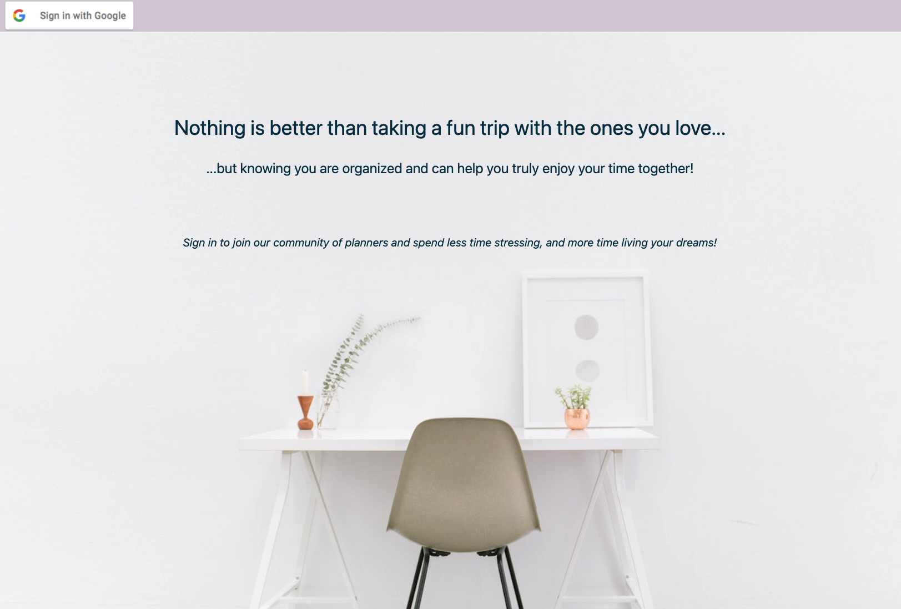
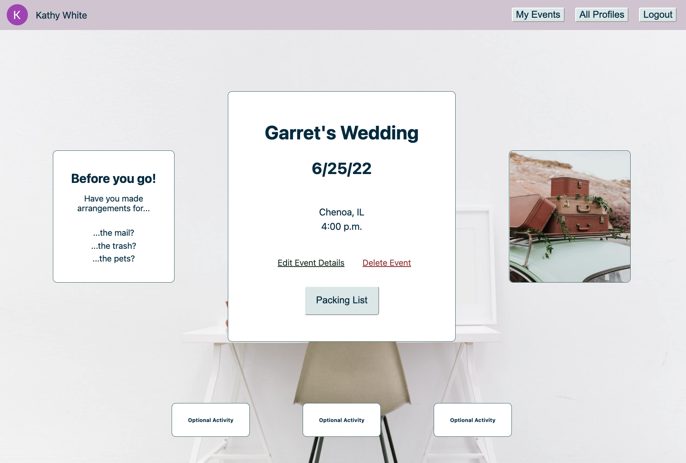
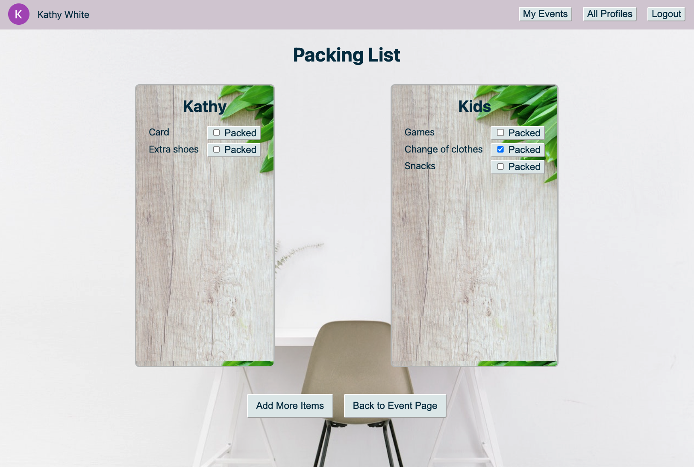

<h1>Traveling made easy!</h1>

:airplane: :car: This travel prep web application is designed to help you prepare for your adventures! Each user has their own profile that they can add events to and add all of the details of the event (date range, location, etc.). Also included, a packing list feature that allows you to add multiple household members and track which items need packed and which have been packed! Leave the stress of vacation planning behind by keeping organized!  

*"For every minute spent organizing, an hour is earned." -Benjamin Franklin*  

  

## Launch the application [here](https://travel-prep-app.herokuapp.com/)  
## View my Trello board [here](https://trello.com/b/wNaoO7iA/travel-prep-app)

## Technologies used :floppy_disk:

CSS  
JavaScript  
HTML  
git  
Node.js  
MongoDB  
Google OAuth  

## Credits

[Clipboard Favicon](https://favicon.io/emoji-favicons/clipboard/)  

-[Photo by Lukas Blazek on Unsplash](https://unsplash.com/s/photos/wood?utm_source=unsplash&utm_medium=referral&utm_content=creditCopyText)
-[Photo by Bench Accounting on Unsplash](https://unsplash.com/s/photos/desk?utm_source=unsplash&utm_medium=referral&utm_content=creditCopyText)  
-[Photo by Jefferson Sees on Unsplash](https://unsplash.com/s/photos/luggage?utm_source=unsplash&utm_medium=referral&utm_content=creditCopyText)  
-[Photo by Wiser by the Mile on Unsplash](https://unsplash.com/s/photos/luggage?utm_source=unsplash&utm_medium=referral&utm_content=creditCopyText)
  

  
  

## Currently Working On :exclamation:

- [ ] Adding update feature mark items packed/not packed  

## Ice Box Goals

- [ ] Add Option to Upload Personal Photo to Event  :camera:

- [ ] Add Optional Activities Schema  :circus_tent:   :ferris_wheel:  
      - Add activities in the area you would like to do
        - Include details: link to website, estimated cost, estimated time needed,    comments section.  
      - Add option to edit/delete Optional Activities

- [ ] Add Lodging information Schema  :hotel:  
      - Add lodging details: confirmation number, lodging website, lodging address, lodging phone number, rate, cancellation policy.  
      - Add option to edit/delete Lodging